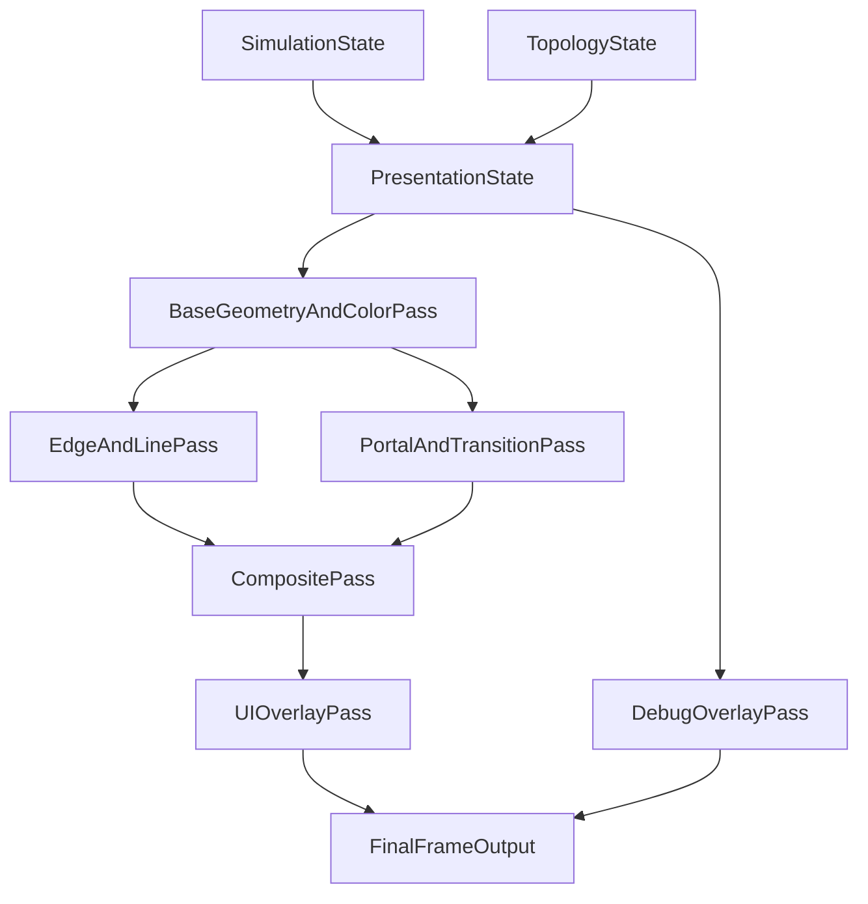

# Graphics Pipeline Architecture

## Purpose
Define the canonical graphics pipeline for MVP and near-post-MVP work. This is the source of truth for rendering architecture decisions and graphics acceptance criteria.

**Plain language:** This doc is the agreed recipe for **how the game draws a frame** in ordered steps (**passes**). Game rules and “what connects to what” (**simulation** and **topology**) stay in charge; drawing code **reads** their state and must not silently change gameplay. A **render pass** is one slice of that recipe (for example: draw solid shapes, then outlines, then portals). The **composite** step blends those slices into one image before HUD. For term definitions, see [READING_GUIDE.md](../READING_GUIDE.md).

## Scope
- Visual presentation systems only.
- Must remain aligned with deterministic simulation and logical topology ownership.
- Applies to Godot 4.x project architecture.

## Non-scope
- Full gameplay simulation logic.
- Content authoring specifics per level (covered by design/data docs).

## Guiding constraints
- Readability first.
- Geometry-first visual language.
- Minimal custom art dependency.
- Visual layer is downstream from simulation/topology truth.
- Debuggability is a first-class requirement.

## High-level pipeline model

## Pass responsibilities

### Base geometry and color pass
- Render core geometry with palette-driven materials.
- Preserve clear silhouettes and movement readability.
- Provide buffers needed for later edge/composite passes as available.

### Edge and line pass
- Provide stable contour/depth cues.
- Must avoid noisy flicker and preserve gameplay readability.
- Must expose quality toggles and fallback behavior.
- **MVP implementation (Phase C):** a fullscreen `canvas_item` shader (`res://shaders/screen_space_edges.gdshader`) composited after the 3D world via `EdgePostProcessLayer` (`CanvasLayer` between `ShapeView` and UI). The shader samples `hint_screen_texture` only (luminance + chroma Sobel + tunable tint). **Tier0** disables the operator for fallback readability; **Tier1/Tier2** increase edge response. Depth/normal buffers are not sampled in this tier—upgrade path is a compositor/depth copy if coplanar same-color silhouettes become a blocking readability issue.

### Portal and transition pass
- Render portal presentation and traversal transitions.
- Must not imply invalid topology connections.
- Transition effects must preserve user orientation.

### Wrapping and continuity cues (Phase D)
- Wrap cues are presentation-only duplicates/markers layered on top of topology-authored layout.
- Repeat-space copies must be visibly marked as continuity context (not new adjacency).
- Directional anchors and return cues must remain readable via non-text geometric/palette signals when edge and portal state cues are active.
- Wrapping profile requires a fallback mode that reduces/disabled cues without breaking baseline readability.

### Composite pass
- Combine base, edge, and portal outputs consistently.
- Keep post effects subtle and readability-safe.

### UI and debug overlays
- UI communicates goals/state without hiding world cues.
- Debug overlays include portal graph/state and instability state visibility.

## Data contracts
- Graphics systems consume immutable snapshots at frame boundaries.
- Simulation and topology remain authoritative.
- No graphics pass may mutate gameplay state directly.

## Quality tiers and fallback policy
- Tier 0: Maximum readability baseline (must always work).
- Tier 1: Enhanced edge quality and transitions.
- Tier 2: Additional polish effects.

Fallback rules:
- If performance or artifact risk exceeds budget, degrade to lower tier gracefully.
- Non-critical effects can be disabled before readability-critical effects.

## Debug tooling requirements
- Toggleable overlays for:
  - active face and orientation context
  - portal connectivity/state
  - instability trigger/result visibility
  - item-flow readability checks
- Visual diagnostics should be available in development builds.

## Performance posture
- Prioritize correctness and readability during MVP.
- Establish baseline budgets after vertical slice.
- Any expensive effect requires:
  - profiling notes
  - fallback path
  - acceptance impact assessment

## Risks and mitigations
- Risk: Visual polish obscures puzzle state.
  - Mitigation: Readability checks and debug overlays.
- Risk: Portal/instability effects imply false adjacency.
  - Mitigation: Topology-authored cues and explicit state indicators.
- Risk: Over-scoped rendering features delay MVP.
  - Mitigation: Tiered rollout and phase-gate enforcement.

## Definition of done for graphics capabilities
Each major graphics capability is done when:
1. Behavior matches vision principles.
2. Acceptance checks pass in representative levels.
3. Fallback path is documented and tested.
4. Related roadmap/subplan and execution docs are updated.

## Related documents
- `docs/READING_GUIDE.md` (glossary and newcomer reading paths)
- `docs/VISION/GRAPHICS_VISION.md`
- `docs/ROADMAP/GRAPHICS_ROADMAP.md`
- `docs/ROADMAP/subplans/*`
- `docs/ADR/*`

## Change log
- 2026-04-15: Initial canonical graphics pipeline architecture created.
- 2026-04-15: Added newcomer-oriented plain-language framing and link to reading guide.
- 2026-04-15: Linked reading guide from related documents.
- 2026-04-15: Documented delivered Phase C edge pass composition (screen-space canvas shader + tiers) and depth/normal deferral note.
- 2026-04-15: Added Phase D wrapping/continuity cue constraints (marked repeat-space copies, orientation anchors, and fallback expectation).
- 2026-04-15: Tightened Phase D continuity constraint to non-text directional cues and palette/geometry signaling.
