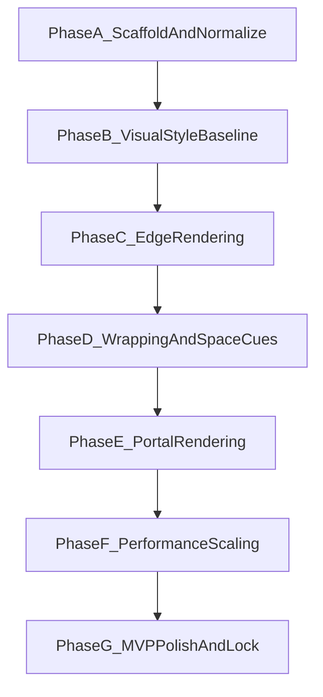

# Graphics Roadmap

## Purpose
Provide phase-gated sequencing for the graphics initiative so implementation remains aligned with readability, scope, and architecture constraints.

**Plain language:** Think of **phases** as a sequence of milestones (A, B, C, …) rather than one giant “make it pretty” task. Each phase ends with a **gate**: a short checklist of evidence and reviews that must pass before we treat the milestone as done and lean harder on the next one. That keeps risky polish from landing before basics like readability. Decode **`VSS-AC##`** (Phase B) in [READING_GUIDE.md](../READING_GUIDE.md); decode **`ERS-AC##`** (Phase C) in [EXECUTION/GRAPHICS_PHASE_C_EXECUTION.md](../EXECUTION/GRAPHICS_PHASE_C_EXECUTION.md) until promoted to the reading guide.

## Milestone flow

## Phase definitions

### Phase A: Scaffold and normalize
- Output:
  - doc architecture
  - vision and architecture source-of-truth docs
  - subplans and rule framework
- Gate:
  - docs and rule baseline accepted and linked

### Phase B: Visual style baseline
- Output:
  - geometry-first style system
  - baseline palette/material conventions
  - readability checks for core gameplay entities
- Gate:
  - baseline visuals pass objective readability acceptance checks (`VSS-AC01` to `VSS-AC08`)
  - Phase C edge pass prerequisites are confirmed in subplan/execution docs

### Phase status snapshot
- Phase A: complete
- Phase B: **complete** — objective gate closed; execution checklist matches [GRAPHICS_PHASE_B_EVIDENCE.md](../EXECUTION/GRAPHICS_PHASE_B_EVIDENCE.md) (`VSS-AC01`–`VSS-AC08`).
- Phase C: **complete** — edge pass delivered with tiers + evidence in [GRAPHICS_PHASE_C_EVIDENCE.md](../EXECUTION/GRAPHICS_PHASE_C_EVIDENCE.md); execution checklist closed in [GRAPHICS_PHASE_C_EXECUTION.md](../EXECUTION/GRAPHICS_PHASE_C_EXECUTION.md).
- Phase D: **in execution** — baseline wrapping cues implemented and evidenced in [GRAPHICS_PHASE_D_EXECUTION.md](../EXECUTION/GRAPHICS_PHASE_D_EXECUTION.md) and [GRAPHICS_PHASE_D_EVIDENCE.md](../EXECUTION/GRAPHICS_PHASE_D_EVIDENCE.md); final gate sign-off pending manual capture set.

### Phase C: Edge rendering
- Output:
  - initial edge pass
  - quality and fallback toggles
  - artifact test matrix
- Gate:
  - edges improve readability without destabilizing frame output
  - objective acceptance checks `ERS-AC01` to `ERS-AC06` pass with evidence pack requirements in [GRAPHICS_PHASE_C_EXECUTION.md](../EXECUTION/GRAPHICS_PHASE_C_EXECUTION.md)
  - [EDGE_RENDERING_PLAN.md](subplans/EDGE_RENDERING_PLAN.md) reconciled with delivered behavior (deferrals documented)

### Phase D: Wrapping and spatial cues
- Output:
  - world wrapping cues suitable for target presentation approach
  - orientation aids and continuity checks
- Gate:
  - players retain orientation across repeated spatial traversal

### Phase E: Portal rendering
- Output:
  - portal visuals and transitions
  - state visibility for static and unstable portal contexts
- Gate:
  - transitions preserve topology comprehension and user orientation

### Phase F: Performance scaling
- Output:
  - quality tiers
  - fallback behavior and profile defaults
  - performance verification record
- Gate:
  - required platforms meet budget with acceptable quality

### Phase G: MVP polish and lock
- Output:
  - consistency pass across all MVP levels
  - documentation lock and ADR updates
- Gate:
  - visual system is stable, documented, and ship-ready for MVP scope

## Stream dependencies
- Visual style baseline informs all later phases.
- Edge rendering should stabilize before portal polish.
- Portal rendering depends on topology clarity and orientation cues.
- Performance scaling starts earlier as measurement, but finalizes after major effects land.

## Risk register (high level)
- Scope risk: advanced effects attempted before baseline readability.
- Drift risk: implementation diverges from docs.
- Performance risk: quality effects exceed budget on target hardware.
- Comprehension risk: portal/instability visuals create false adjacency assumptions.

## Governance
- Each phase start must:
  - confirm acceptance criteria
  - confirm current and next-phase detail level
  - link execution checklist
- Each phase end must:
  - update roadmap and relevant subplans
  - record decisions in decision log and ADRs as needed
- **Graphics execution doc coupling:** Whenever `docs/EXECUTION/GRAPHICS_PHASE_<LETTER>_EXECUTION.md` or `docs/EXECUTION/GRAPHICS_PHASE_<LETTER>_EVIDENCE.md` changes, refresh **this roadmap in the same change** (phase status snapshot, related-document list if paths are added/renamed, phase gate bullets if acceptance IDs or evidence expectations shift, and a change log entry below).

## Related documents
- `docs/ARCHITECTURE/GRAPHICS_PIPELINE.md`
- `docs/READING_GUIDE.md`
- `docs/ROADMAP/subplans/*.md`
- `docs/ROADMAP/subplans/VISUAL_STYLE_SYSTEM_PLAN.md`
- `docs/ROADMAP/subplans/EDGE_RENDERING_PLAN.md`
- `docs/EXECUTION/GRAPHICS_PHASE_B_EXECUTION.md`
- `docs/EXECUTION/GRAPHICS_PHASE_B_EVIDENCE.md`
- `docs/EXECUTION/GRAPHICS_PHASE_C_EXECUTION.md`
- `docs/EXECUTION/GRAPHICS_PHASE_C_EVIDENCE.md`
- `docs/EXECUTION/GRAPHICS_PHASE_D_EXECUTION.md`
- `docs/EXECUTION/GRAPHICS_PHASE_D_EVIDENCE.md`

## Change log
- 2026-04-15: Initial graphics roadmap created.
- 2026-04-15: Added phase status snapshot and linked Phase B evidence completion state.
- 2026-04-15: Updated phase status to reflect post-bugfix manual revalidation requirement before Phase C start.
- 2026-04-15: Added newcomer-oriented plain-language framing and link to reading guide.
- 2026-04-15: Refreshed for Phase C execution scaffold: phase snapshot, Phase C gate alignment with `ERS-AC##`, expanded related documents, and governance rule to co-update this roadmap with graphics execution/evidence doc edits.
- 2026-04-15: Phase B gate closed after `VSS-AC01`/`VSS-AC03`/`VSS-AC04` revalidation; Phase C marked in flight for edge rendering delivery.
- 2026-04-15: Phase C gate closed — edge rendering shipped with `ERS-AC01`–`ERS-AC06` evidence; roadmap snapshot advanced to Phase D readiness.
- 2026-04-15: Reconciled roadmap metadata after Phase C closeout (`GRAPHICS_PHASE_C_EVIDENCE.md` now treated as authored canonical evidence doc).
- 2026-04-15: Renamed graphics execution/evidence doc references from numeric phase filenames to alphabetical roadmap-aligned filenames (Phase B/Phase C).
- 2026-04-15: Added Phase D execution scaffold linkage and updated phase snapshot to "in planning" for wrapping/spatial cues.
- 2026-04-15: Advanced Phase D snapshot to "in execution" after baseline wrapping cue delivery and linked `GRAPHICS_PHASE_D_EVIDENCE.md`.
- 2026-04-15: Reconciled Phase D docs after baseline cue refinements (non-text continuity cues, live profile switching) and clarified evidence as provisional pending manual capture gate close.
- 2026-04-15: Cross-doc reconciliation: PRD/TECH win-condition wording, MVP Level 3 trigger alignment with GDD, cadence/subplan/Phase B execution header updates (see Phase D execution change log).
